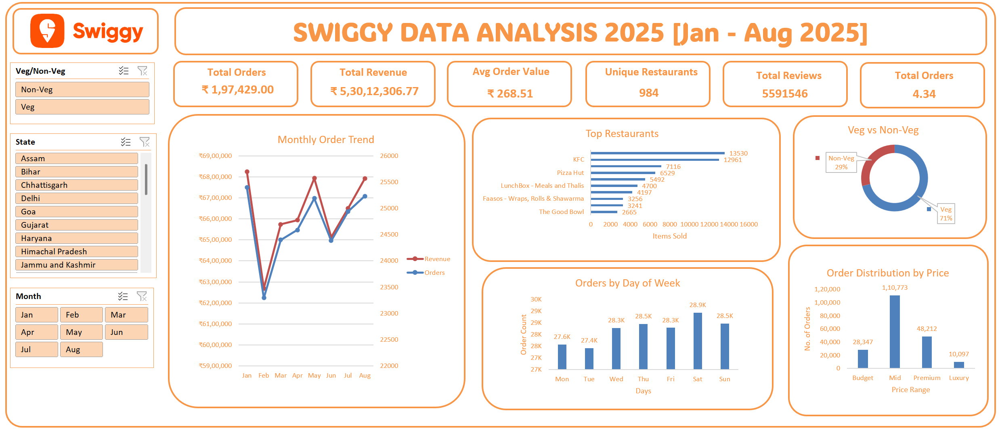

# 🍔 Swiggy Data Analysis Dashboard 2025

An interactive **Excel-based dashboard** analyzing Swiggy food delivery orders across India from **January to August 2025** — covering revenue trends, top restaurants, order patterns, and price distribution.



---

## 📊 Overview

This dashboard was built entirely in **Microsoft Excel** using Pivot Tables, slicers, and charts to deliver a dynamic, filterable view of Swiggy order data. It covers **1,97,429 orders** across **28 Indian states**, tracking revenue, order trends, restaurant performance, and customer preferences.

---

## ✨ Features

- **KPI Summary Cards** — Instant view of Total Orders, Total Revenue, Avg Order Value, Unique Restaurants, Total Reviews, and Avg Rating
- **Monthly Order Trend** — Dual-axis line chart tracking Revenue and Order Count from Jan–Aug 2025
- **Top Restaurants** — Horizontal bar chart ranking restaurants by items sold
- **Orders by Day of Week** — Bar chart showing order volume across Mon–Sun
- **Veg vs Non-Veg Donut Chart** — Visual split of vegetarian vs non-vegetarian orders
- **Order Distribution by Price Range** — Bar chart across Budget, Mid, Premium, and Luxury tiers
- **Interactive Filters** — Slicers for Veg/Non-Veg, State, and Month

---

## 🗂️ File Structure

```
SWIGGY_dashboard.xlsx
├── Swiggy Orders    # Raw dataset (1,97,429 records)
├── Sheet1           # Pivot Tables and aggregation layer
├── Sheet2           # Dashboard visuals
```

---

## 📁 Dataset

| Column | Description |
|---|---|
| `State` | Indian state of the order |
| `City` | City where the order was placed |
| `Order Date` | Date of the order (Jan–Aug 2025) |
| `Day` | Day of the week (Mon–Sun) |
| `Quarter` | Quarter (Q1 / Q2 / Q3) |
| `Week No` | ISO week number |
| `Restaurant` | Restaurant name |
| `Area` | Locality / area within the city |
| `Category` | Food category (e.g. North Indian, Chinese, Snack) |
| `Item Name` | Name of the food item ordered |
| `Veg/Non-Veg` | Whether the item is vegetarian or non-vegetarian |
| `Price` | Item price (₹) |
| `Rating` | Restaurant rating (out of 5) |
| `No. of Ratings` | Total number of ratings for the restaurant |
| `Price Bucket` | Derived: Budget / Mid / Premium / Luxury |
| `Rating Category` | Derived: Excellent / Good / Average / Poor |
| `Month` | Derived month label (Jan, Feb, …) |
| `Month-Year` | Derived month-year label (e.g. Jan-2025) |
| `Day Type` | Derived: Weekday or Weekend |

**Total Records:** 1,97,429 orders across 28 states, Jan–Aug 2025

---

## 📈 Key Metrics (Jan–Aug 2025)

| Metric | Value |
|---|---|
| Total Orders | 1,97,429 |
| Total Revenue | ₹5,30,12,306.77 |
| Avg Order Value | ₹268.51 |
| Unique Restaurants | 984 |
| Total Reviews | 55,91,546 |
| Avg Rating | 4.34 |

---

## 🥗 Veg vs Non-Veg Split

| Category | Orders | Share |
|---|---|---|
| Veg | 1,40,442 | 71% |
| Non-Veg | 56,987 | 29% |

---

## 💰 Orders by Price Range

| Price Bucket | Price Range | No. of Orders |
|---|---|---|
| Budget | ≤ ₹100 | 28,347 |
| Mid | ₹101–₹300 | 1,10,773 |
| Premium | ₹301–₹600 | 48,212 |
| Luxury | > ₹600 | 10,097 |

---

## 🏆 Top Restaurants (by Items Sold)

| Rank | Restaurant | Items Sold |
|---|---|---|
| 1 | McDonald's | 13,530 |
| 2 | KFC | 12,961 |
| 3 | Burger King | 7,116 |
| 4 | Pizza Hut | 6,529 |
| 5 | Domino's Pizza | 5,492 |
| 6 | LunchBox – Meals and Thalis | 4,700 |

---

## 🗺️ States Covered

Assam, Bihar, Chhattisgarh, Delhi, Goa, Gujarat, Haryana, Himachal Pradesh, Jammu & Kashmir, Jharkhand, Karnataka, Kerala, Madhya Pradesh, Maharashtra, Manipur, Meghalaya, Mizoram, Nagaland, Odisha, Punjab, Rajasthan, Sikkim, Tamil Nadu, Telangana, Tripura, Uttar Pradesh, Uttarakhand, West Bengal

---

## 🚀 Getting Started

### Prerequisites

- Microsoft Excel 2016 or later (recommended for full slicer and Pivot Table support)
- Excel for Mac or Excel Online may have limited slicer functionality

### Usage

1. **Download** `SWIGGY_dashboard.xlsx`
2. **Open** the file in Microsoft Excel
3. Navigate to the **Dashboard** sheet
4. Use the **Veg/Non-Veg**, **State**, and **Month** slicers on the left panel to filter the data
5. All charts and KPI cards will update dynamically based on your selections

---

## 🛠️ Built With

- **Microsoft Excel** — Pivot Tables, Pivot Charts, Slicers, Conditional Formatting, Calculated Columns
- **Data Visualization** — Line chart, Bar charts, Donut chart, KPI cards
- **Dashboard Design** — Swiggy-branded orange and white theme

---

## 📌 Notes

- The dataset covers **January 2025 to August 2025** only
- `Price Bucket`, `Rating Category`, `Month`, `Month-Year`, and `Day Type` are derived columns calculated via Excel formulas
- Price ranges from ₹0.95 (Budget) to ₹8,000 (Luxury)

---

## 📄 License

This project is open for personal and educational use. Feel free to fork, modify, and build upon it.

---

## 🙋 Author

Built with ❤️ using Excel. Contributions and feedback are welcome!